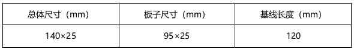
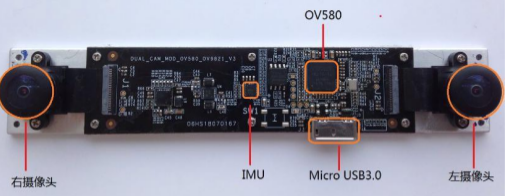
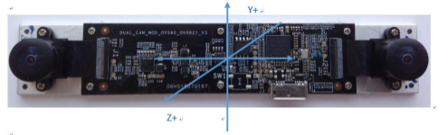
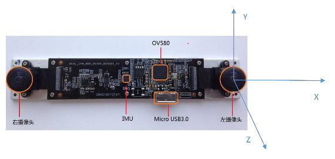

.. _product_surface:

尺寸结构
==================

尺寸结构如表所示：

模组实物图（拆去壳体后）：

左、右摄像头: 左、右摄像头为传感器镜头,使用中请注意保护,以避免成像质量下降。

IMU: 高频率 IMU 硬件,结合双目摄像头,实现精准定位,相机与 IMU 安装精密,切勿拆卸。

OV580: 图像、IMU 数据获取芯片。

Micro USB3.0:使用中,插上 Micro USB3.0 数据线后,保持连接处自然受力,不弯折,以避免使用中损坏接口,或导致数据连接不稳定。

IMU Coordinate System(IMU 坐标系统):IMU 坐标系统为右手系,坐标轴方向如图所示:

世界坐标系:世界坐标系为当地地理水平坐标系,X、Z 轴沿水平,Y 轴朝天向,方位。0 度为模组初始化 Z 轴指向,坐标系原点为初始化时模值左目镜头位置。

输出数据:X、Y、Z 位置,姿态四元数,其中位置为 IMU 在世界坐标系下的位置(IMU位于双目模组中间位置),其中姿态为 IMU 在世界坐标系下的姿态。